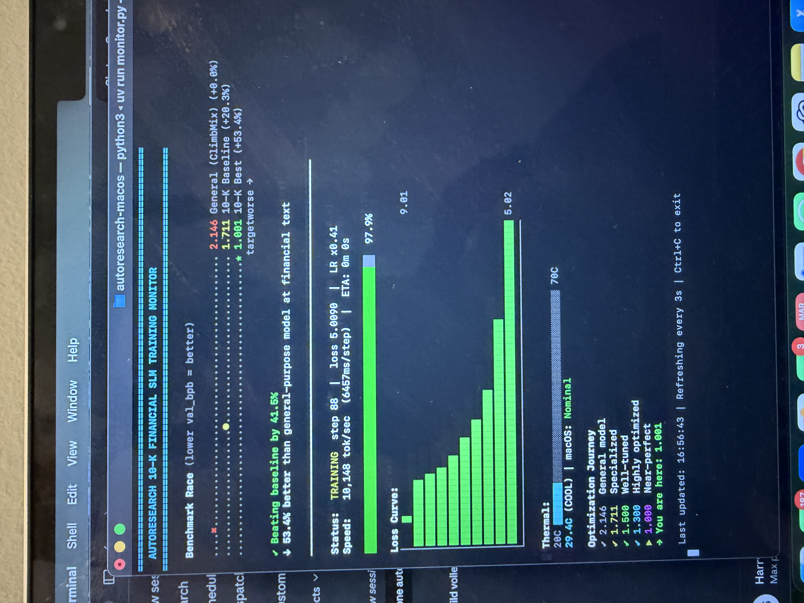

# 10-K Financial SLM

A tiny (11.5M parameter) GPT language model trained exclusively on SEC 10-K filings from financial companies. Built using [Karpathy's autoresearch](https://github.com/karpathy/autoresearch) framework with an AI agent (Claude) autonomously running experiments on a MacBook Air. ~20 experiments at 5 minutes each, ~2 hours of total GPU time.

**[Model on HuggingFace](https://huggingface.co/HarryS64/10k-financial-slm)** · **[GitHub Repo](https://github.com/harryschaefer93/autoresearch-10k-macos)**

<p align="center">
  
  
</p>
<p align="center"><em>Left: Live training dashboard tracking the optimization journey. Right: Our "cooling solution" — a MacBook Air on a dehumidifier. It worked.</em></p>

## Results

| Metric | Value |
|--------|-------|
| Compression (val_bpb) | **1.645** (vs 2.146 general baseline) |
| Improvement over general model | **23.3%** |
| Inference speed | 75,000+ tok/sec on MacBook Air |
| Time per 10-K filing | ~1 second |
| Cost to process all 80K SEC filings | **$0** (vs $15K+ via API) |

## The Question

Can a tiny model trained exclusively on financial text outperform a general-purpose model of the same size at understanding financial documents? And can we use autonomous AI-driven experimentation to optimize it?

## What We Did

### Step 1: Built a financial data pipeline

We wrote `prepare_10k.py` to pull 10-K filings directly from SEC EDGAR:

1. Downloaded the quarterly master index (2015-2025) — found ~80,000 10-K filings total
2. Filtered to financial companies only (SIC codes 6000-6411: banks, insurance, investment firms) — 18,538 filings
3. Sampled 1,500, downloaded full text, cleaned HTML/XBRL markup
4. Kept 1,131 high-quality filings after filtering out too-short or too-numeric documents
5. Chunked into 60,095 training sequences (2,048 tokens each) + 6,677 validation sequences
6. Trained a domain-specific BPE tokenizer (8,192 vocab) on the financial text

### Step 2: Established baselines

We trained the same 11.5M parameter GPT architecture on two datasets:

- **ClimbMix** (general web text): val_bpb = 2.146
- **10-K financial text**: val_bpb = 1.711

Just swapping the training data — same model, same hyperparameters — gave a **20% improvement** on financial text compression. Domain specialization works.

### Step 3: Autonomous hyperparameter optimization

This is where [autoresearch](https://github.com/karpathy/autoresearch) comes in. We pointed Claude at the training script and let it run experiments autonomously. Each experiment:

1. Modify `train.py` (change learning rates, schedules, architecture, etc.)
2. Train for exactly 5 minutes
3. Check if val_bpb improved
4. Keep the change or revert, log results, repeat

We ran ~15 experiments. Here's what happened:

| Experiment | Change | val_bpb | Outcome |
|------------|--------|---------|---------|
| Baseline | Default config | 1.711 | Starting point |
| 1.5x learning rates | LR 0.6->0.9, 0.04->0.06 | 1.677 | **Kept** |
| 2x learning rates | Too aggressive | 1.700 | Reverted |
| Warmdown 0.5->0.3 | Keep LR high longer | 1.658 | **Kept** |
| Warmdown 0.3->0.15 | Even longer | 1.646 | **Kept** |
| Warmdown 0.15->0.05 | Nearly no cooldown | **1.645** | **Kept (best)** |
| Add 5% warmup | Ramp LR slowly | 1.749 | Reverted |
| Depth 4->6 | More layers | OOM | Reverted |
| Depth 4->5 | Slightly more layers | Too slow | Reverted |
| Batch 16->32 | Less grad accumulation | OOM | Reverted |
| 4 heads (head_dim 64) | More attention heads | 2.042 | Reverted |
| Half batch size | More steps, noisier | 1.707 | Reverted |
| SSSL window pattern | Sliding window attention | 1.819 | Reverted |

**Final best: 1.645 val_bpb** (3.9% improvement from tuning on top of the 20% from specialization).

### Step 4: What we learned the hard way

**Thermal throttling was the biggest confound.** On a MacBook Air (no fan), the M-series chip throttles aggressively under sustained load. Our step times swung from 3.6s to 148s mid-run, making experiments unreliable. We wasted several rounds before realizing the "improvements" were just thermal noise.

The fix was embarrassingly simple: **put the laptop on a dehumidifier** (see photo above). After that, step times stabilized at ~3.6s and throughput went from erratic to a consistent ~18,000 tok/sec. This alone increased our steps-per-run from ~68 to ~91 — a bigger improvement than most hyperparameter changes.

**What worked:**
- Higher learning rates (1.5x default) — the 5-minute budget means the model needs to learn fast
- Minimal warmdown — with so few steps, spending half the budget cooling down the LR wastes training time
- Keeping the model small — deeper/wider models couldn't converge in 5 minutes even if they had more capacity

**What didn't work:**
- Architecture changes (more layers, different attention patterns) — not enough training time to benefit
- Smaller batch sizes — more steps but noisier gradients, net negative
- Warmup — the model needs high LR from step 0 with random weights
- float16/bfloat16 autocast on MPS — no speedup on Apple Silicon (no tensor cores)
- torch.compile on MPS — not supported in PyTorch 2.6

## Benchmarks

### 1. Compression Quality

| Model | val_bpb | Notes |
|-------|---------|-------|
| General model (ClimbMix) | 2.146 | Same architecture, general web text |
| **10-K specialized model** | **1.645** | Same architecture, financial text |

23.3% better compression = the model captures financial language patterns significantly better.

### 2. Inference Speed (MacBook Air M2, MPS)

| Mode | Latency | Throughput |
|------|---------|------------|
| Single sequence (2,048 tokens) | 27ms | 75,000 tok/sec |
| Batched (16 x 2,048 tokens) | ~0.4s | 75,000+ tok/sec |
| One full 10-K filing (~75K tokens) | ~1 second | - |
| All 80K SEC EDGAR filings | ~22 hours | - |

### 3. Cost to Process Full SEC Database (~80K filings, ~6B tokens)

| Approach | Price/1M input tokens | Cost (6B tokens) |
|----------|----------------------|-------------------|
| GPT-4o API | $2.50 | ~$15,000 |
| Claude Sonnet 4.6 API | $3.00 | ~$18,000 |
| Claude Haiku 4.5 API | $1.00 | ~$6,000 |
| GPT-4o-mini API | $0.15 | ~$900 |
| **This model (local)** | **$0** | **$0** |

*Prices as of March 2026. Input tokens only (processing/embedding), no output generation.*

## Potential Uses

This model won't replace GPT-4 for deep financial analysis. It's a **specialized tool** for specific use cases where speed, cost, and privacy matter:

- **Document embeddings** — fast similarity search across thousands of filings
- **Anomaly detection** — flag filings with unusual language patterns
- **Pre-filtering** — cheap triage before sending to an expensive API
- **Privacy-preserving analysis** — data never leaves the device
- **Edge deployment** — small enough to run on a phone
- **Fine-tuning foundation** — starting point for downstream financial NLP tasks

## What We'd Try Next

- **Longer training** (hours not minutes) on a machine with proper cooling
- **Scale to 50-100M parameters** while staying edge-deployable
- **Downstream tasks** — sector classification, sentiment analysis, NER on financial text
- **Broader corpus** — earnings calls, proxy statements, analyst reports
- **Quantization** — INT8/INT4 for even faster inference on mobile

## Quick Start

```bash
# Install uv (if you don't have it)
curl -LsSf https://astral.sh/uv/install.sh | sh

# Install dependencies
uv sync

# Download and prepare 10-K data (~5 min)
AUTORESEARCH_CACHE=~/.cache/autoresearch-10k uv run prepare_10k.py

# Train the model (5 min on Apple Silicon)
AUTORESEARCH_CACHE=~/.cache/autoresearch-10k uv run train.py

# Run benchmarks
AUTORESEARCH_CACHE=~/.cache/autoresearch-10k uv run benchmark.py

# Live training dashboard (run in a separate terminal)
uv run monitor.py
```

## Project Structure

| File | Purpose |
|------|---------|
| `train.py` | Model + training loop (the file autoresearch modifies) |
| `prepare.py` | Original ClimbMix data pipeline |
| `prepare_10k.py` | SEC EDGAR 10-K data pipeline |
| `benchmark.py` | Perplexity, speed, and cost benchmarks |
| `monitor.py` | Live terminal dashboard with loss curves + thermal monitoring |
| `program.md` | Instructions for the AI agent |
| `MODEL_CARD.md` | Full model card for HuggingFace |
| `benchmark_results.json` | Machine-readable benchmark results |

## Requirements

- macOS with Apple Silicon (M1/M2/M3/M4) or NVIDIA GPU
- Python 3.10+
- [uv](https://astral.sh/uv) package manager

## Acknowledgments

- [Andrej Karpathy](https://karpathy.ai) / [autoresearch](https://github.com/karpathy/autoresearch) for the training framework
- [miolini/autoresearch-macos](https://github.com/miolini/autoresearch-macos) for the macOS/MPS port
- [Claude Code](https://claude.ai/claude-code) for autonomous experiment orchestration
- SEC EDGAR for public filing data

## License

MIT

---

*This project is a fork of [autoresearch-macos](https://github.com/miolini/autoresearch-macos). Original README below.*

---


*One day, frontier AI research used to be done by meat computers in between eating, sleeping, having other fun, and synchronizing once in a while using sound wave interconnect in the ritual of "group meeting". That era is long gone. Research is now entirely the domain of autonomous swarms of AI agents running across compute cluster megastructures in the skies. The agents claim that we are now in the 10,205th generation of the code base, in any case no one could tell if that's right or wrong as the "code" is now a self-modifying binary that has grown beyond human comprehension. This repo is the story of how it all began. -@karpathy, March 2026*.

The idea: give an AI agent a small but real LLM training setup and let it experiment autonomously overnight. It modifies the code, trains for 5 minutes, checks if the result improved, keeps or discards, and repeats. You wake up in the morning to a log of experiments and (hopefully) a better model. The training code here is a simplified single-GPU implementation of [nanochat](https://github.com/karpathy/nanochat). The core idea is that you're not touching any of the Python files like you normally would as a researcher. Instead, you are programming the `program.md` Markdown files that provide context to the AI agents and set up your autonomous research org. The default `program.md` in this repo is intentionally kept as a bare bones baseline, though it's obvious how one would iterate on it over time to find the "research org code" that achieves the fastest research progress, how you'd add more agents to the mix, etc. A bit more context on this project is here in this [tweet](https://x.com/karpathy/status/2029701092347630069).

## Open source project worth to look at

Open source collabaration platform for agentic swarms in organizations and communityies. 

[SentientWave Automata](https://github.com/sentientwave/automata)

## How it works

The repo is deliberately kept small and only really has a three files that matter:

- **`prepare.py`** — fixed constants, one-time data prep (downloads training data, trains a BPE tokenizer), and runtime utilities (dataloader, evaluation). Not modified.
- **`train.py`** — the single file the agent edits. Contains the full GPT model, optimizer (Muon + AdamW), and training loop. Everything is fair game: architecture, hyperparameters, optimizer, batch size, etc. **This file is edited and iterated on by the agent**.
- **`program.md`** — baseline instructions for one agent. Point your agent here and let it go. **This file is edited and iterated on by the human**.

By design, training runs for a **fixed 5-minute time budget** (wall clock, excluding startup/compilation), regardless of the details of your compute. The metric is **val_bpb** (validation bits per byte) — lower is better, and vocab-size-independent so architectural changes are fairly compared.

## Quick start

**Requirements:** Apple Silicon Mac (M1/M2/M3/M4 with Metal/MPS support) or a single NVIDIA GPU, Python 3.10+, [uv](https://docs.astral.sh/uv/).

```bash

# 1. Install uv project manager (if you don't already have it)
curl -LsSf https://astral.sh/uv/install.sh | sh

# 2. Install dependencies
uv sync

# 3. Download data and train tokenizer (one-time, ~2 min)
uv run prepare.py

# 4. Manually run a single training experiment (~5 min)
uv run train.py
```

If the above commands all work ok, your setup is working and you can go into autonomous research mode.

**Platforms support**. This fork officially supports **macOS (Apple Silicon / MPS)** and CPU environments, while preserving the original NVIDIA GPU support. It removes the hardcoded dependency on FlashAttention-3, falling back to PyTorch's native Scaled Dot Product Attention (SDPA) with manual sliding window causal masking when needed. It also features MPS-specific optimizations (disabling unsupported `torch.compile` paths, lowering memory batch sizes for Metal bounds, and precisely casting optimizer states) allowing you to run autonomous research agents directly on your Mac!

## Running the agent

Simply spin up your Claude/Codex or whatever you want in this repo (and disable all permissions), then you can prompt something like:

```
Hi have a look at program.md and let's kick off a new experiment! let's do the setup first.
```

The `program.md` file is essentially a super lightweight "skill".

## Project structure

```
prepare.py      — constants, data prep + runtime utilities (do not modify)
train.py        — model, optimizer, training loop (agent modifies this)
program.md      — agent instructions
pyproject.toml  — dependencies
```

## Design choices

- **Single file to modify.** The agent only touches `train.py`. This keeps the scope manageable and diffs reviewable.
- **Fixed time budget.** Training always runs for exactly 5 minutes, regardless of your specific platform. This means you can expect approx 12 experiments/hour and approx 100 experiments while you sleep. There are two upsides of this design decision. First, this makes experiments directly comparable regardless of what the agent changes (model size, batch size, architecture, etc). Second, this means that autoresearch will find the most optimal model for your platform in that time budget. The downside is that your runs (and results) become not comparable to other people running on other compute platforms.
- **Self-contained.** No external dependencies beyond PyTorch and a few small packages. No distributed training, no complex configs. One GPU, one file, one metric.

## Platform support

This code currently requires that you have a single NVIDIA GPU. In principle it is quite possible to support CPU, MPS and other platforms but this would also bloat the code. I'm not 100% sure that I want to take this on personally right now. People can reference (or have their agents reference) the full/parent nanochat repository that has wider platform support and shows the various solutions (e.g. a Flash Attention 3 kernels fallback implementation, generic device support, autodetection, etc.), feel free to create forks or discussions for other platforms and I'm happy to link to them here in the README in some new notable forks section or etc.

If you're going to be using autoresearch on Apple Macbooks in particular, I'd recommend one of the forks below. On top of this, if you'd like half-decent results at such a small scale, I'd recommend this [TinyStories dataset](https://huggingface.co/datasets/karpathy/tinystories-gpt4-clean) which is cleaner than what exists out there otherwise. It should be a drop in replacement because I have encoded it in exactly the same format. Any of your favorite coding agents should be able to do the swap :)

## Notable forks

- [miolini/autoresearch-macos](https://github.com/miolini/autoresearch-macos)
- [trevin-creator/autoresearch-mlx](https://github.com/trevin-creator/autoresearch-mlx)

## License

MIT
